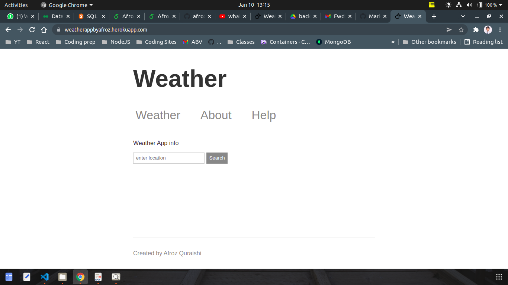
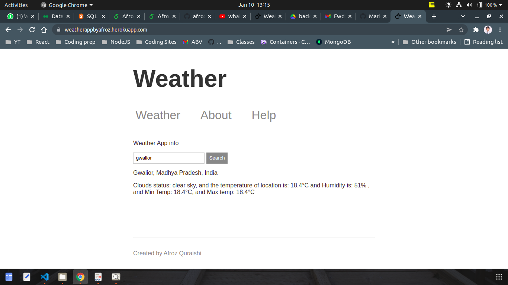

# WEATHER APP

[Live Link ](https://weatherappbyafroz.herokuapp.com/)

-   An Application that gives the weather update of a particular location and it
    uses an API which takes a location name and it generates longitude and
    latitude of that location. After that it uses another Api for forecasting
    the data.
-   Technologies Used: Node.js, Express, HTML, CSS, API’s .

## Home page

## Result

